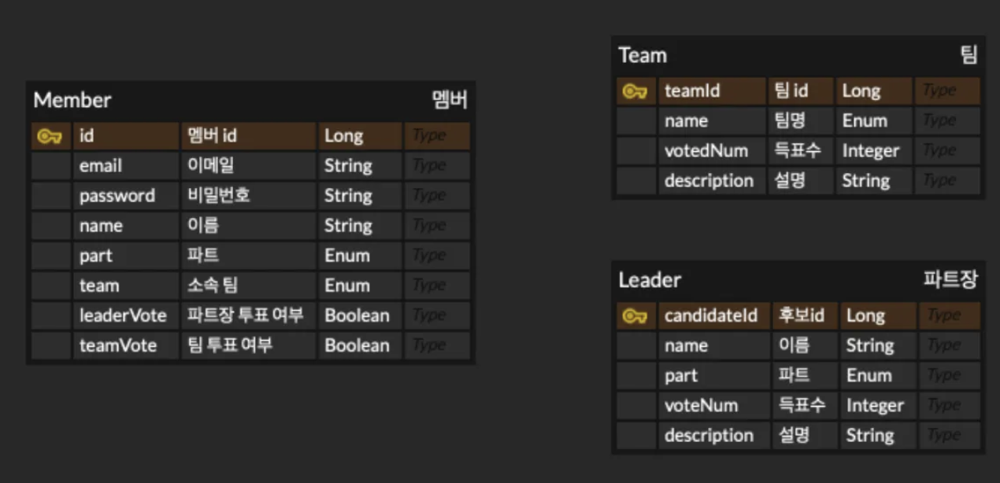
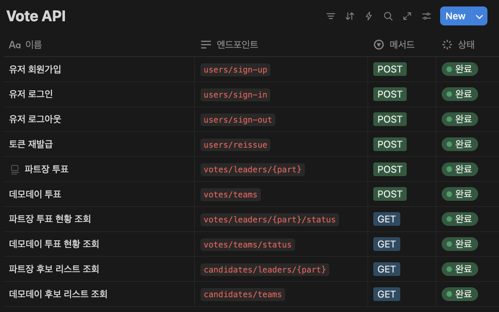

# CEOS back-end 21st vote project

## 컨벤션

### commit 메세지 작성 규칙

- 커밋 메세지명은 `#[issue번호] 동작: 커밋내용` 으로 작성
- 커밋 메세지는 행위의 내용을 모두 포함할 수 있도록 자세히 작성
- commit 메시지 **유형**은 다음과 같다.
    - **feat**: 기능 추가, 삭제, 변경
    - **fix**: 버그 수정
    - **docs**: 문서 추가, 삭제, 변경
    - **style**: 코드 형식, 정렬, 주석 등의 변경, eg; 세미콜론 추가
    - **refactor**: 코드 리펙토링
    - **test**: 테스트 코드 추가
    - **chore**: 위에 해당하지 않는 모든 변경

### Package Structures: Package by Feature (도메인형)

```
Example)

├── src
│   ├── company
│   ├──  ├── CompanyController
│   ├──  ├── CompanyEntity
│   ├──  ├── CompanyRepository
│   ├──  ├── CompanyService
│   ├──  ├── CompanyDTO
│   ├── customer
│   ├──  ├── CustomerController
│   ├──  ├── CustomerEntity
│   ├──  ├── CustomerRepository
│   ├──  ├── CustomerService
│   ├──  ├── CustomerDTO
│   ├── product
│   ├──  ├── ProductController
│   ├──  ├── ProductEntity
│   ├──  ├── ProductRepository
│   ├──  ├── ProductService
│   ├──  ├── ProductDTO
└── └── utils
```

### Work Rules

- 개인 레포지토리로 전체 레포의 Develop 브랜치에서 Fork 하기
- 각자 작업 진행 후 Pull Request 올리기 (절대 직접 커밋 x)
- Pull Request 제목: `동작: 이슈 이름`
- 1명 이상 팀원의 승인이 있으면 Push 가능하도록 룰 설정

## 투표 기능 구현
### ERD


### API 명세서


### 배포 사이트
- [vote.influy.com](https://vote.influy.com/swagger-ui/index.html#)

## 참고
### 이번 개발 플젝의 목표: 간단!
  - ERD는 최대한 간단하게! (테이블 최소화, 연결 최소화)
### 이니셜라이저
  - CommandLineRunner를 통해 스프링 어플리케이션 시작과 동시에 후보자 목록 개수가 0개면 후보자를 등록하도록 설정
  - JSON 파일을 읽어 entity로 만든 후 DB에 저장하는 방식
### EOF 따옴표
  - CI/CD 과정에서 깃시크릿에 있는 application.yml을 복사하여 생성하는 과정에서 `cat << EOF`를 사용했는데, 여기서 문제 발생
  - `cat << EOF` 면 yml 내부에 있는 환경변수들이 먼저 치환되어 들어가게 되는데 그 시점에는 값이 없어서 null로 처리되면서 에러 발생
  - 이 부분을 `cat << 'EOF'` 로 바꿔서 문자 그대로 반영되었다가 실행 시점에 `docker-compose.yml`의 환경변수 값으로 치환될 수 있도록 함

    ```bash
    - name: Create application.yml
      shell: bash
      run: |
        mkdir -p src/main/resources
        cat <<'EOF' > src/main/resources/application.yml
        ${{ secrets.APPLICATION_PROD_YML }}
        EOF
    ```
### 백엔드에서 처리한 투표 관련 예외처리
```java
// 유저 관련 에러 응답
USER_ALREADY_EXISTS(HttpStatus.BAD_REQUEST, "USER ALREADY EXISTS", "유저가 이미 존재합니다."),
USER_NOT_FOUND(HttpStatus.NOT_FOUND, "USER NOT FOUND", "유저를 찾을 수 없습니다."),

//파트장 관련 에러 응답
LEADER_NOT_FOUND(HttpStatus.NOT_FOUND, "LEADER NOT FOUND", "파트장 후보를 찾을 수 없습니다."),

//투표 관련 에러 응당
WRONG_PART(HttpStatus.FORBIDDEN, "WRONG PART", "투표자와 투표 대상의 파트가 다릅니다."),
ALREADY_VOTED(HttpStatus.FORBIDDEN, "ALREADY_VOTED", "투표는 한 번만 할 수 있습니다."),

//팀 관련 에러 응답
TEAM_NOT_FOUND(HttpStatus.NOT_FOUND, "TEAM NOT FOUND", "팀 후보를 찾을 수 없습니다."),
NOT_VALID_VOTE(HttpStatus.BAD_REQUEST, "NOT VALID VOTE", "본인 팀에게 투표할 수 없습니다."),
```